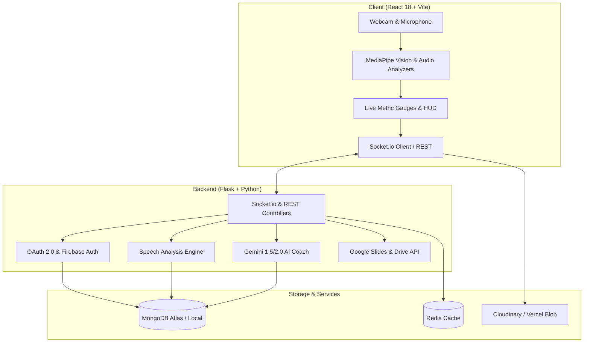

# 🎤 AI-Powered Presentation Coach for Boosting Speaker

[](https://react.dev/)
[](https://flask.palletsprojects.com/)
[](https://www.mongodb.com/)
[](https://tailwindcss.com/)
[](https://developers.google.com/mediapipe)
[](https://ai.google.dev/)
[](LICENSE)

An intelligent, real-time presentation coaching system designed to elevate speaker confidence and delivery. By blending real-time computer vision (Google MediaPipe), speech-rate and filler-word detection, and generative AI feedback (Google Gemini), the Presentation Coach gives presenters instantaneous, actionable cues as well as post-session evaluation metrics.

---

## 🌟 Key Features

- **📹 Real-Time Computer Vision Tracking**: Detects posture, head tilt, shoulder alignment, and hand gestures using Google MediaPipe Pose & Face Landmark detection.
- **👁 Eye Contact & Attention Analysis**: Computes gaze direction and eye contact percentage to ensure effective audience connection.
- **🗣 Hybrid Speech Analysis**: Real-time Words-Per-Minute (WPM) tracking, speech rhythm, pause detection, and filler word detection (`um`, `uh`, `like`, `you know`).
- **🤖 Generative AI Coaching**: Instant contextual coaching prompts powered by Google Gemini during sessions, followed by detailed multi-criteria performance reports.
- **📊 Google Slides & Drive Integration**: Direct OAuth 2.0 integration to import slides, follow presentation flow, and export feedback summaries into slide speaker notes.
- **📈 Historical Progress & Analytics**: Visual progress charts tracking eye contact, posture consistency, and filler reduction across historical rehearsals.
- **🎥 Cloud Recording & Playback**: Session audio/video recording with Cloudinary and Vercel Blob integrations for synchronized review and self-critique.

---

## 🏗 System Architecture



---

## 🛠 Tech Stack

### Frontend
- **Framework**: React 18, Vite
- **Styling**: Tailwind CSS, PostCSS, Custom Dark Theme Glassmorphism
- **Computer Vision**: Google MediaPipe Tasks Vision (`@mediapipe/tasks-vision`)
- **Speech Engine**: Web Speech API + Hybrid Audio Worklet Analyzer
- **Real-time Comms**: Socket.io Client
- **Auth & Storage**: Firebase Authentication, Cloudinary Video Player

### Backend
- **Framework**: Python 3.10+ / Flask, Flask-CORS, Flask-SocketIO
- **Database & Cache**: MongoDB (PyMongo), Redis
- **AI / LLM**: Google Gemini API (`google-generativeai`)
- **Third-Party APIs**: Google Slides API, Google Drive API, Google OAuth 2.0
- **Server Deployment**: Gunicorn, WSGI, Procfile

### DevOps & Testing
- **Containerization**: Multi-stage `Dockerfile` & Docker Compose
- **CI/CD**: Jenkins declarative pipeline
- **Testing**: Pytest unit & integration test suite

---

## 📁 Repository Structure

```
.
├── api/
│   └── index.py                     # Serverless entry point
├── backend/
│   ├── app.py                       # Flask application factory & WebSocket setup
│   ├── config.py                    # Environment & configuration management
│   ├── models.py                    # MongoDB data models (Users, Sessions, Feedback)
│   ├── Procfile                     # Deployment process definition
│   ├── requirements.txt             # Python backend dependencies
│   ├── wsgi.py                      # Production WSGI gateway
│   ├── routes/
│   │   ├── analyze.py               # Real-time and summary feedback endpoints
│   │   ├── auth.py                  # Google OAuth & session authentication
│   │   ├── presentations.py         # Google Slides import and management
│   │   └── sessions.py              # Practice session CRUD operations
│   └── services/
│       ├── drive_service.py         # Google Drive integration
│       ├── gemini_service.py        # Gemini AI prompt orchestration
│       ├── google_auth.py           # OAuth 2.0 token management
│       ├── slides_service.py        # Google Slides speaker notes export
│       └── vercel_blob_service.py   # Cloud asset storage
├── frontend/
│   ├── index.html                   # Single-page application root
│   ├── package.json                 # Node dependencies and build scripts
│   ├── tailwind.config.js           # Tailwind design tokens
│   ├── vite.config.js               # Vite build configuration
│   └── src/
│       ├── App.jsx                  # Main application router
│       ├── main.jsx                 # React root renderer
│       ├── analyzers/               # MediaPipe vision & speech analyzers
│       │   ├── FaceAnalyzer.js      # Gaze, blink & eye contact tracking
│       │   ├── HybridSpeechAnalyzer.js # Combined WPM & pause detector
│       │   ├── PoseAnalyzer.js      # Posture & gesture detector
│       │   └── SpeechAnalyzer.js    # Web Speech API wrapper
│       ├── components/              # Reusable UI widgets & layout elements
│       │   ├── Layout/Sidebar.jsx   # Collapsible navigation drawer
│       │   └── UI/                  # Progress rings, video players, toasts
│       ├── contexts/                # React Context providers (Auth, Session)
│       ├── pages/                   # Application views
│       │   ├── AuthPage.jsx         # Sign-in & onboarding
│       │   ├── DashboardPage.jsx    # Metrics overview & quick launch
│       │   ├── PracticePage.jsx     # Live coaching HUD & camera feed
│       │   ├── FeedbackPage.jsx     # Post-session scorecards & AI breakdown
│       │   ├── ProgressPage.jsx     # Trend charts & historical sessions
│       │   └── SettingsPage.jsx     # Coach preference settings
│       └── services/                # Backend API & Cloudinary connectors
├── docker-jenkins-pytest-spec.md    # Coursework specification for Docker & Jenkins
├── requirements.txt                 # Top-level dependencies
└── sample.html                      # Standalone interactive preview demo
```

---

## 🚀 Getting Started

### Prerequisites
- **Node.js**: v18.0.0 or higher
- **Python**: v3.10 or higher
- **MongoDB**: Local instance running on port 27017 or MongoDB Atlas connection URI
- **Google Cloud Console Credentials**: OAuth 2.0 Client ID (with Google Slides & Drive APIs enabled)
- **Google Gemini API Key**: From [Google AI Studio](https://aistudio.google.com/)

---

### 1. Clone the Repository
```bash
git clone https://github.com/MR-WHOAMEYE/AI-POWERED-PRESENTATION-COACH-FOR-BOOSTING-SPEAKER.git
cd AI-POWERED-PRESENTATION-COACH-FOR-BOOSTING-SPEAKER
```

---

### 2. Backend Setup
```bash
cd backend

# Create and activate virtual environment
python -m venv venv

# Windows:
venv\Scripts\activate
# macOS/Linux:
source venv/bin/activate

# Install dependencies
pip install -r requirements.txt

# Configure environment variables
cp .env.example .env
```

Edit `backend/.env`:
```env
GOOGLE_CLIENT_ID=your_google_client_id
GOOGLE_CLIENT_SECRET=your_google_client_secret
GOOGLE_REDIRECT_URI=http://localhost:5000/auth/callback
GEMINI_API_KEY=your_gemini_api_key
SECRET_KEY=your_secure_secret_key
MONGO_URI=mongodb://localhost:27017/presentation_coach
FRONTEND_URL=http://localhost:5173
```

Run the backend server:
```bash
python app.py
```
Backend will start on `http://localhost:5000`.

---

### 3. Frontend Setup
```bash
cd ../frontend

# Install dependencies
npm install

# Configure environment variables
cp .env.example .env
```

Edit `frontend/.env`:
```env
VITE_API_URL=http://localhost:5000
VITE_GEMINI_API_KEY=your_gemini_api_key
```

Run the Vite development server:
```bash
npm run dev
```
Frontend will be available at `http://localhost:5173`.

---

## 🔗 Key API Endpoints

| Method | Endpoint | Description |
|---|---|---|
| `GET` | `/auth/google` | Initiates Google OAuth 2.0 flow |
| `GET` | `/auth/callback` | Handles OAuth redirect and issues token |
| `GET` | `/auth/status` | Verifies active session authentication |
| `GET` | `/presentations` | Retrieves user's Google Slides presentations |
| `GET` | `/presentations/<id>` | Fetches slide deck structure and notes |
| `POST` | `/presentations/<id>/feedback` | Exports AI summary to slide speaker notes |
| `GET` / `POST` | `/sessions` | Lists past sessions or registers a new rehearsal |
| `POST` | `/analyze/realtime` | Submits frame/audio metrics for live coaching cues |
| `POST` | `/analyze/summary` | Generates comprehensive AI post-session scorecard |

---

## 👥 Project Contributors

This project was developed collaboratively with specialized contributions across architecture, backend engineering, and frontend design:

| Contributor | GitHub Profile | Responsibilities |
|---|---|---|
| **MR-WHOAMEYE** *(Lead Contributor)* | [@MR-WHOAMEYE](https://github.com/MR-WHOAMEYE) | System architecture, Google MediaPipe vision models, Google Gemini AI orchestration, DevOps & CI/CD specifications |
| **prajan20** | [@prajan20](https://github.com/prajan20) | Flask REST API endpoints, MongoDB schemas & data models, Speech recognition services, OAuth 2.0 authentication |
| **dinesh3300** | [@dinesh3300](https://github.com/dinesh3300) | Vite + React application architecture, Tailwind CSS design system, Dashboard pages, Session progress tracking & UI components |

---

## 📄 License

Distributed under the MIT License. See `LICENSE` for more information.

---

## 🙏 Acknowledgments
- [Google MediaPipe](https://developers.google.com/mediapipe) for robust client-side pose and face mesh tracking.
- [Google AI Studio (Gemini)](https://ai.google.dev/) for real-time natural language coaching feedback.
- [Google Workspace APIs](https://developers.google.com/workspace) for seamless Google Slides integration.
